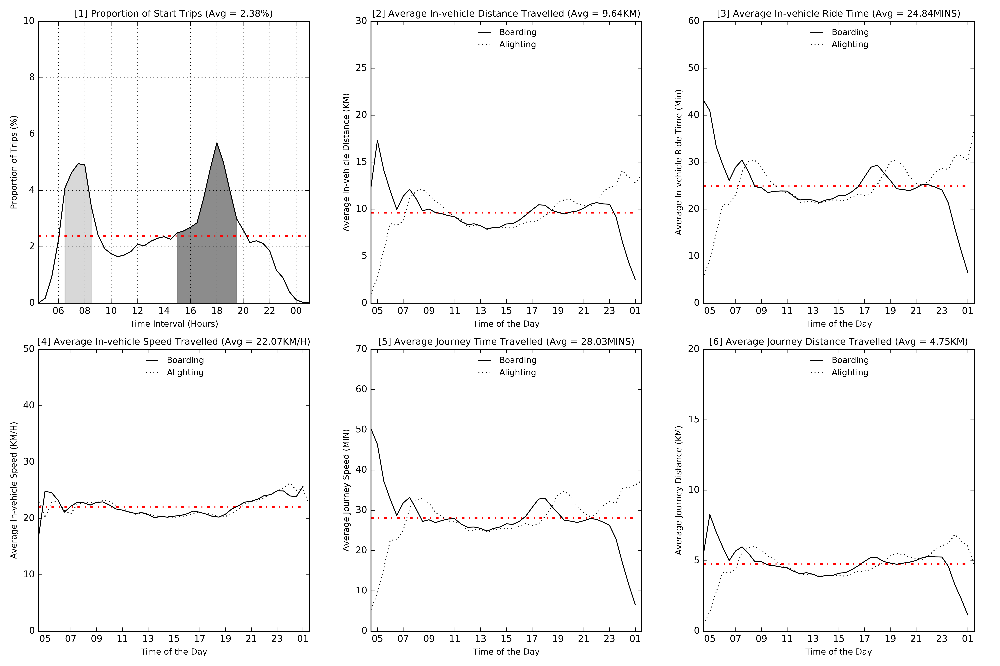

# Geovisualization of Urban Mobility Patterns of Singapore’s New Towns/Estates From Transit Smart Card Data

[Download Paper here](https://s3-ap-southeast-1.amazonaws.com/delonleogithubio/visualisation_ez_link_card_20160423.pdf)

[View Jupyter Notebook here](https://github.com/delonleo/visualisation_ez_link_card/visualisation_ez_link_card_20160327.ipynb)

## About 

Understanding urban mobility behaviour is essential for the planning and management of urban infrastructures and services. Traditionally, researchers have relied on travel diary surveys as a means of data collection for urban mobility behaviour research. However, the use of this data collection method falls short due to its small sample size and the low frequency of surveys that can be collected. Thus, in recent years, researchers have been developing data mining techniques to extract meaningful mobility patterns from alternative travel trajectory data sources, which include global positioning systems, transit smart cards, mobile phone traces, and location-based social media data. The use of such data is considered more cost-effective, less error-prone, and less labour-intensive than traditional travel diaries. In this paper, aspects of urban mobility patterns are explored through the use of transit smart cards. Using a day’s worth of transit smart card data, which amounts to over 5 million trip records, this paper uncovers the temporal and spatiotemporal individual trajectory patterns of each of Singapore’s 23 new towns and three estates. Findings from the transit smart card data showed a high degree of regularity of travel behaviour at the individual level in each new town and estate. In addition, the findings revealed that Singapore’s central region remains a strong centre of trip attraction despite its continuous decentralization efforts. The data processing and analytical framework for temporally and spatiotemporally quantifying, visualizing, and examining urban mobility patterns at the new town or estate level that is developed in this paper has the potential to provide more refined and targeted urban and transport policies for local neighbourhoods.

## Key Visulisations  

*Temporal Mobility Patterns of Singapore*

*Spatiotemporal Patterns of Singapore by the Time of Day
(Origin of All New Town / Estate)*

*Origins of New Town / Estate for the Day*

